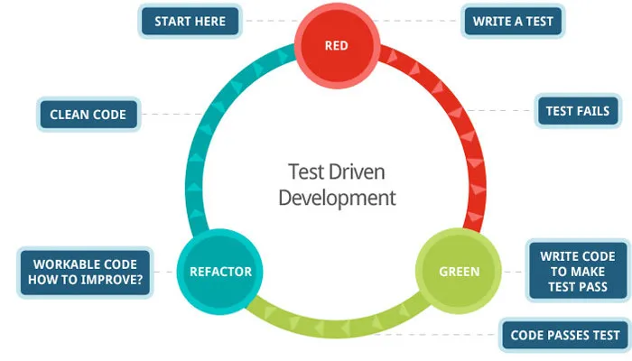

# TDD and pytest at IV

## Introduction to TDD

### What is Test Driven Development?

Test Driven Development (TDD) is a development style where tests are written before the code.

This approach encourages simple designs and increases confidence in the codebase by ensuring that all functionality is tested from the start.

### What are the benefits of Test Driven Development?

- **Improved Code Quality**: Writing tests first ensures that the code meets its requirements from the start.
- **Refactoring Confidence**: Developers can refactor with confidence, knowing that any changes are verified by existing tests. Any changes that break the application are caught.
- **Reduced Debugging Time**: Bugs are caught early in the development cycle, which reduces the time spent on debugging.
- **Documentation**: Tests act as a form of documentation, providing insights into how the code is intended to work. This makes it much easier for developers who are new to a project to get quickly acquainted with the code.

### TDD Best Practices (Red, Green, Refactor)

- **Red**: Write a test that fails. This test represents a piece of functionality that has not yet been implemented.
- **Green**: Write the minimum amount of code necessary to make the test pass. This code does not have to be perfect; it just has to work.
- **Refactor**: Improve the code while keeping the tests passing. This might involve removing duplication, improving readability, or optimizing performance.



## Introduction to pytest

### What is pytest?

`pytest` is a popular testing framework for Python, and has become the de facto testing framework within the Python development space.

It's simple, flexible, and provides a number of features, such as fixtures and parameterization. There are also an extensive number of plugins available for specific needs, such as request mocking and code coverage.

### Why use pytest?

- **Ease of Use**: `pytest` is easy to start with because it requires minimal boilerplate code.
- **Powerful Features**: It includes features like fixtures, assertions, and parameterized tests that make writing tests more efficient.
- **Extensible**: `pytest` supports plugins, which allow for customisation and additional functionalities.
- **Readability**: The output of `pytest` is clear and concise, making it easy to understand what went wrong when a test fails.

## Setting up pytest

### Installation

To install `pytest`, you can use pip to install it on your virtual environment:

```bash
pip install pytest
```

Alternatively, you can add pytest to your `test_requirements.txt` file:

```
pytest==7.1.x
```

Then run:

```bash
pip install -r requirements/test_requirement.txt
```

### Test directory and file naming conventions

- **Directory Structure**: Place your tests in a directory named tests at the root of your project. This can then be split into test types or mirror the structure of your source code. A common structure I like to use is:

```bash
.
└── tests
    ├── conftest.py  # Common fixture shared between multiple modules
    ├── data  # Directory containing data used in your tests (ie. csv files to be loaded by a fixture)
    ├── unit  # Unit tests - tests focused on individual functions.
    └── integration  # Initegration tests - tests involving multiple components working together.
```

- **File Naming**: Test files must start with `test`. For example, test_example.py.
- **Function Naming**: Test functions should also start with `test`. For example, `def test_feature_a():`

When run, pytest will then automatically discover test files and functions based on the above naming conventions.

### Running your first test

Create a file named `test_demo.py` in your tests directory with the following content:

```python
def test_sum():
    x = 1
    y = 2
    assert sum([x, y]) == 3
```

Run the test using the command:

```bash
pytest
```

Pytest will automatically discover and execute the `test_sum` function.

The output should show `test_demo.py` passing successfully:

```bash
========================================= test session starts ==========================================
platform linux -- Python 3.11.0rc1, pytest-8.3.2, pluggy-1.5.0
rootdir: /home/matt/code/demo
collected 1 item

test_demo.py::test_sum PASSED                                                                     [100%]

========================================== 1 passed in 0.01s ===========================================
```

## Key Features

### Assertions

pytest uses Python's built-in assert statement for assertions, making the code more readable and maintainable.

Example:

```
def test_sum():
    assert sum([1, 2, 3]) == 6
```

### Running specific tests

A specific test file or function can be run using the following commands:

```bash
# Run all tests in a specific file
pytest path/to/test_file.py

# Run a specified test in a file
pytest path/to/test_file.py::test_function

# Alernatively, a specific test can be run by name
pytest -k test_function
```

### Fixtures

Fixtures are functions that are executed before (and sometimes after) the tests.

They are primarily used for setting up the test environment, creating reusable test objects (ie. dummy data), and performing clean up actions after a test function has exited.

Test functions can use fixtures by declaring them as parameters. Pytest will search through the declared fixtures for any fixtures which match the parameter name, run the fixture, and inject the output into the test function, allowing it to be accessed using the fixture name within the test function.

```python
import pytest


@pytest.fixture
def sample_data() -> list:
    return [1, 2, 3]

def test_sum(sample_data):
    assert sum(sample_data) == 6
```

A fixture can also have a scope, which is defined when labeling the fixture with the `@pytest.fixture` decorator using the `scope` parameter; this determines how long the fixture’s setup lasts and when it is invoked.

- `function` (default): Fixture setup runs before each test function.
- `class`: Fixture setup runs once per test class.
- `module`: Fixture setup runs once per module file.
- `session`: Fixture setup runs once per test session.

For example, the following fixture will now only run once each test session. Any modifications made to the fixture’s state will be shared across all tests in the session.

```python
@pytest.fixture(scope="session")
def sample_data() -> list:
    return [1, 2, 3]
```

### Parametrization

Parametrization allows you to run a test function with different sets of data. This is done using the marker `@pytest.mark.parametrize`.

This marker takes two arguments:

1. A comma-separated string containing the variable names that will be passed to the test function.
2. A list of tuples, where each tuple represents a set of values corresponding to the variables defined in the string.

Each tuple represents a different test case with its own input and expected output, allowing for multiple scenarios to be tested within a single test function.

```python
import pytest


@pytest.mark.parametrize("a,b,expected", [
    (1, 1, 2),
    (2, -2, 0),
    (3, 0, 3),
])
def test_sum(a, b, expected):
    assert input == expected
```

In this example, the `test_sum` function is executed three times with three different sets of values for `a`, `b` and `expected`.

### Exceptions

Exception testing in pytest is done using the `pytest.raises` context manager, which is designed to check if a specific exception is raised when a piece of code is executed.

```python
import pytest


def test_zero_division():
    with pytest.raises(ZeroDivisionError) as err:
        x = 1 / 0

    assert str(err.value) == 'division by zero'
```

The example test `test_zero_division` will pass since `x = 1 / 0` raises a `ZeroDivisionError`, which is captured by `pytest.raises`. The contents of an exception can also be inspected, as seen in the assert statement. This is particularly useful when working with custom exceptions.

### Caplog

Caplog is a built-in fixture in pytest that allows for logs to be inspected. To use caplog, pass `caplog` in as a fixture to the test function - no import is required.

The fixture injects a context manager into the test function that can then be used to inspect the contents of any logs produced during the test by evaluating `caplog.text`. The level of log capturing can be specified using `at_level` when calling caplog, which by default is `logging.INFO`.

```python
import logging

logger = logging.getLogger(__name__)

def log_message() -> None:
    logger.info("log_message function run successfully")

def test_log_message(caplog):
    # Run the code being tested within the caplog context manager
    with caplog.atlevel(logging.INFO):
        log_message()

    # Inspect the logs captured by caplog
    assert "log_message function run successfully" in caplog.text
```

### Markers

Markers are used to mark test functions and then selectively execute them. These are declared using the `@pytest.mark` decorator on your test functions:

```python
@pytest.mark.<marker_name>
```

A group of marked tests can then be selectively executed using:

```
pytest -m slow
```

For example, a set of tests which involve database operations could be marked with `database` and run together to test the database functionality of your application:

```python
@pytest.mark.database
```

Markers can also be used to skip unfinished tests. For example:

```python
import pytest


@pytest.mark.skip(reason="not yet implemented")
def test_feature():
    ...
```

The above test will now be skipped when running the test suite.

### Further Features

There are a number of advanced features which are not discussed here, but are . These include:

- [pytest-cov](https://pypi.org/project/pytest-cov/): plugin for measuring test coverage
- [pytest-mock](https://pytest-mock.readthedocs.io/en/latest/usage.html): plugin for mocking and patching within test functions
- [requests-mock](https://requests-mock.readthedocs.io/en/latest/pytest.html): plugin for mocking HTTP requests

## Debugging Tests

Tests can be debugged in terminal using the `pbdpp` (Python debugger++).

To install:

```
pip install pdbpp
```

Then place a `breakpoint()` within your code. Run the specified test and use the debugger to inspect the state of the function, step into target functions, and follow the logic through.

## Summary and wrap up

- TDD helps in building robust software with a focus on writing tests before the actual code.
- pytest is a powerful, easy-to-use testing framework that simplifies the testing process in Python projects.
- With features like fixtures, parametrization, and mocking, pytest provides a comprehensive toolset for testing all aspects of your code.
- Implementing TDD with pytest enhances code quality, reduces bugs, and speeds up the development process.

## Further resources

- [Official pytest Documentation](https://docs.pytest.org/en/7.1.x)
- ArjanCodes: [How To Write Unit Tests For Existing Python Code](https://www.youtube.com/watch?v=ULxMQ57engo)
- freeCodeCamp: [Pytest Tutorial – How to Test Python Code](https://www.youtube.com/watch?v=cHYq1MRoyI0)
- Saleem Siddiqui (O'Reilly): [Learning Test-Driven Development](https://www.oreilly.com/library/view/learning-test-driven-development/9781098106461/)
